# 🌐 **ModelAtlas**  
### *Map the Modelverse. Trace the Truth. Shape the Future.*

⸻

## 🧬 Introduction

**ModelAtlas** is a forensic-grade, modular intelligence framework meticulously designed for parsing, enriching, auditing, and visualizing the ever-evolving landscape of foundational AI models.

Crafted for researchers, engineers, analysts, and agentic systems alike, it seamlessly bridges raw metadata with recursive enrichment and deep provenance tracking—creating an inspectable, extensible, and trust-aware knowledge layer that empowers the open model ecosystem.

> 💡 *Trust. Trace. Transform.*

⸻

## 🧠 System Overview

```mermaid
flowchart TD
  subgraph Trace [ModelAtlas Enrichment Trace]
    A[🌐 Ollama Scraper<br/>Collects raw metadata from Ollama.com] --> B[📦 Raw Model Data]
    B --> C[🧠 RECURSOR-1<br/>Recursive Enrichment Agent]
    C --> D[📝 Enriched JSON Records]
    D --> E[🛡️ TrustForge<br/>Score models based on heuristic fusion]
    D --> F[🔍 TracePoint<br/>Lineage & Provenance Debugger]
    D --> G[📊 AtlasView<br/>Visual Analytics Dashboard]
  end
  G --> H[👤 Developer / Analyst]
  F --> H
  E --> H
```



- **Ollama Scraper**: Harvests raw model data, including tags, manifests, and configuration files.
- **RECURSOR-1**: Normalizes fields, infers missing data, and leverages LLMs for comprehensive enrichment.
- **TrustForge**: Computes trust scores by fusing heuristic metrics from multiple data sources and now runs automatically inside the enrichment trace.
- **TracePoint**: Tracks enrichment lineage, prompt decision paths, and source deltas for transparent provenance.
- **AtlasView**: A web-based dashboard enabling search, filtering, comparative analysis, and visual audits.

⸻

## 🧭 Core Components

### `atlas-cli` — 🌐 Semantic Search Interface
- Enables powerful search across enriched model metadata fields.
- Supports embeddings, advanced filters, and fuzzy matching techniques.
- Example usage:  
  ```bash
  atlas search "open model for code completion"
  ```

### `trustforge` — 🛡️ Trust Score Engine
- Aggregates and fuses diverse metrics including:
  - License compliance and compatibility
  - Download statistics and popularity
  - Upstream lineage and provenance
  - LLM-inferred risk assessments
- Produces a comprehensive `trust_score` for each model.

### `recursor` — 🔁 Recursive Enrichment Agent
- Parses manifests and configuration blobs to extract detailed metadata.
- Enriches attributes such as context length, base model lineage, quantization details, and architecture specifics.
- Suggests `tasks.yml` patches to correct or complete missing fields.
- Employs LLMs to intelligently infer and validate metadata where necessary.

### `tracepoint` — 🔍 Provenance & Lineage Debugger
- Enables deep inspection of any model’s provenance by tracing:
  - Original raw scrape data
  - Config blob origins
  - Step-by-step enrichment history
  - Prompt decision trees and rationale
- Usage example:  
  ```bash
  tracepoint llama3:8b --lineage
  ```

### `atlasview` — 📊 React Dashboard
- Developed with Tailwind CSS and Recharts for responsive and interactive visualizations.
- Presents:
  - Model landscape visualizations by size, trust score, and license type
  - Detailed lineage trees illustrating model ancestry
  - Metadata completeness and quality indicators

⸻

## 📁 Project Structure

```text
modelatlas/
├── atlas_cli/             # CLI Tool for semantic search and inspection
├── enrich/                # Recursive enrichers and prompt injectors
├── trustforge/            # Trust scoring engine and heuristics
├── recursor/              # Autonomous enrichment agent logic
├── tracepoint/            # Model inspection and audit trail tools
├── dashboards/            # React-based frontend UI components
├── data/
│   ├── models_raw.json         # Raw, unprocessed scrape data
│   └── models_enriched.json    # Post-enrichment metadata output
├── docs/
│   ├── naming.md
│   ├── schema.md
│   ├── usage_examples.md
│   └── PHASE_2_DESIGN.md
├── AGENTS.md
├── tasks.yml
├── README.md
└── atlas.config.json
```

⸻

## 🛠️ Tech Stack

| Layer         | Technology Stack                      |
|---------------|-------------------------------------|
| Backend       | Python (requests, asyncio, typer)   |
| Dashboard     | React, Tailwind CSS, Recharts       |
| LLMs          | OpenAI, DeepSeek, Gemma, Ollama (local) |
| CLI UX        | `typer`, `rich`, fuzzy search       |
| Storage       | JSON (canonical), YAML (tasks), Git|
| Agents        | RECURSOR-1 + Codex-style patchers   |
| DevOps        | GitHub Actions, local runners       |

⸻

## 🧪 Example Commands

```bash
# Run enrichment trace (includes trust scoring)
python enrich/main.py

# Perform semantic search for multilingual open-license models
atlas search "multilingual open license"

# Trace enrichment lineage for a specific model
tracepoint gemma:2b --lineage

# Launch the interactive dashboard locally
cd dashboards && npm run dev
```

⸻

## 🚀 Naming Subsystem

| Subsystem     | Designation  | Role Description                  |
|---------------|--------------|---------------------------------|
| Full System   | ModelAtlas   | The overarching meta-system      |
| Enrichment    | RECURSOR-1   | Autonomous recursive enrichment agent |
| Trust Engine  | TrustForge   | Assigns and computes trust scores |
| Lineage Tool  | TracePoint   | Debugs provenance and lineage    |
| Dashboard     | AtlasView    | Frontend user interface          |
| CLI           | atlas-cli    | Search and inspection command-line tool |

⸻

## 📋 Meta Documentation

| Documentation File    | Purpose                                         |
|----------------------|------------------------------------------------|
| `AGENTS.md`          | Details on enrichment agents, memory, and state logic |
| `tasks.yml`          | Canonical task graph defining enrichment traces |
| `naming.md`          | Naming philosophy and conventions |
| `schema.md`          | Data schema specification for enriched model entries |
| `usage_examples.md`  | Real-world CLI traces and usage patterns |
| `PHASE_2_DESIGN.md`  | Design notes on manifest decoding, tag repair, and scoring implementation |

⸻

## 🧠 Philosophy

ModelAtlas is founded on these core principles:

- 🔎 *Transparency over Obfuscation*  
- ♻️ *Recursive Enrichment is Integral, Not Optional*  
- 🛡️ *Trust Must Be Quantifiable and Measurable*  
- 🧠 *LLMs Are Tools That Can Self-Improve and Assist*  

We hold that metadata is critical infrastructure, and that systems should be able to explain their own construction with clarity and rigor.

⸻

> **Map the modelscape. Trace the truth. Shape the future.**  
> 🧭 *Welcome to the Atlas.*
