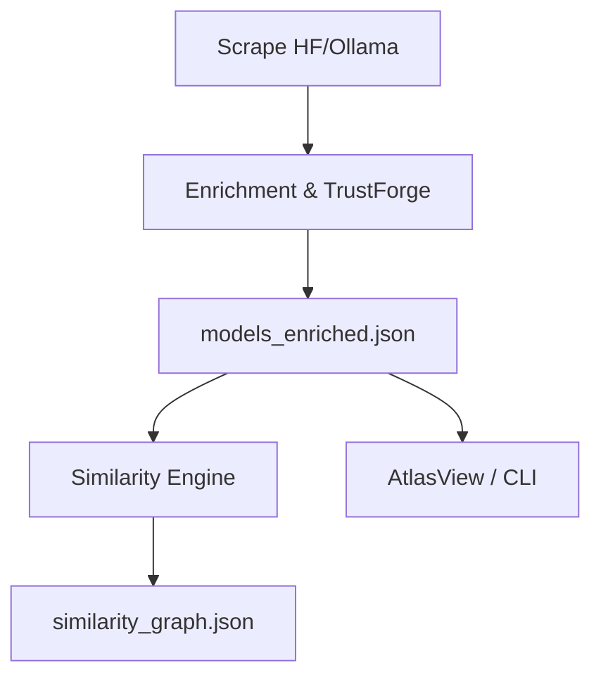

# Repo Audit - July 2025

This report captures the findings from a comprehensive audit of ModelAtlas.

## 1. Executive Summary
ModelAtlas aggregates and enriches LLM metadata from Hugging Face and Ollama. Documentation is rich, but the project lacks polish in areas like licensing, configuration, and test coverage.

## 2. Confirmed Strengths
- Extensive high level docs (`README.md`, `PLAN.md`)
- `tasks.yml` provides granular backlog
- Existing unit tests pass after installing dependencies

## 3. Key Risks & Gaps
- Missing `LICENSE` file
- Documentation references nonexistent scripts
- Inconsistent naming (e.g. `atlas_cli` vs `ollama_search_cli.py`)
- Single large test file and minimal coverage

## 4. Suggested Refactors
- Consolidate CLI into `atlas_cli/` package
- Use Pydantic models for JSON schema
- Centralize logging and text utilities

## 5. README Opening Review
The README opens with a bold mission statement but lacks a quick start snippet. Adding install instructions (`pip install -r requirements.txt && playwright install`) would improve onboarding.

## 6. Optional Architecture Diagram

## 7. Suggested Tests
- Unit tests for `trustforge.compute_score`
- Integration test for `enrich/main.py`

## 8. Agentic Workflow Ideas
- JSON output mode for CLI commands
- Patch generator to update `tasks.yml`

## 9. Issues & Opportunities
- **High:** unclear licensing
- **Medium:** outdated docs and naming drift
- **Low:** Sphinx build warnings

## 10. Actionable Tasks
See `tasks.yml` for a list of proposed tasks derived from this audit.
